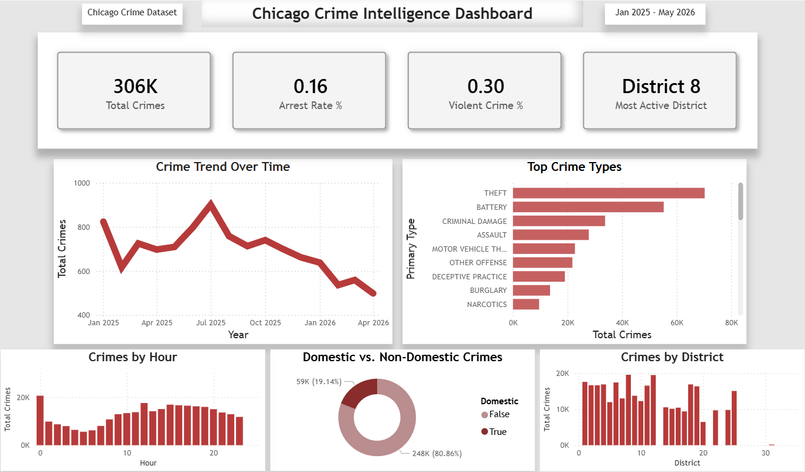

# Chicago Crime Statistical Analysis

## Overview

This project transforms raw Chicago crime data into a structured analytical workflow using **PostgreSQL** and **Microsoft Power BI** to identify meaningful patterns across 306k recorded incidents spanning crime categories, geographic districts, arrest outcomes, and temporal trends.

---

## Table of Contents

- [Business Problem](#business-problem)
- [Solution](#solution)
- [Data Source](#data-source)
- [Methodology](#methodology)
- [SQL Analysis](#sql-analysis)
- [Dashboard Overview](#dashboard-overview)
- [Key Findings](#key-findings)
- [Recommendations](#recommendations)
- [Skills & Tools Used](#skills--tools-used)
- [Next Steps](#next-steps)

---

## Business Problem

Urban crime datasets contain millions of incident-level records that are difficult to interpret without structured analysis. This project was designed to answer key operational and intelligence-focused questions:

- Which crime categories occur most frequently?
- Which districts experience the highest concentration of incidents?
- How have crime patterns changed over time?
- Which crime types produce the highest arrest rates?
- Are there measurable differences between domestic and non-domestic incidents?
- Do temporal patterns reveal seasonality or recurring trends?

---

## Solution

A relational database was created in PostgreSQL using the City of Chicago's open crime dataset. Analytical SQL queries were developed to clean, aggregate, and evaluate crime data across multiple dimensions. The processed data was then visualized in Power BI as an interactive crime intelligence dashboard.

---

## Data Source

- **Dataset:** [Chicago Crime: 2001 to Present](https://data.cityofchicago.org/Public-Safety/Crimes-2001-to-Present/ijzp-q8t2)
- **Source:** City of Chicago Open Data Portal
- **Filtered to:** [Jan 2025 - May 2026]

---

## Methodology

### 1. Data Preparation
- Imported date filtered CSV crime data into PostgreSQL
- Removed incomplete or inconsistent records
- Created calculated fields for time-based analysis

### 2. SQL Analysis
- Developed analytical queries across multiple dimensions (see [SQL Analysis](#sql-analysis) below)
- Connected processed data to Power BI for dashboard development

### 3. Dashboard Development
- Built an interactive dashboard in Microsoft Power BI
- Created new measures using DAX and establishing relationships

---

## SQL Analysis

### Query Categories

| Category | Description |
|---|---|
| Top Crimes | Ranking offense categories by total incident count |
| Crime Type Distribution | Frequency analysis across all offense categories |
| Annual Crime Trend | Year-over-year incident volume tracking |
| Monthly Crime Patterns | Seasonal and cyclical trend identification |
| District-Level Analysis | Geographic crime concentration by district |
| Arrest Rate Analysis | Arrest effectiveness by offense type |
| Domestic vs. Non-Domestic | Incident breakdown by domestic classification |
| Crime Hotspot Analysis | Identifying common crime zones by block|

### Key SQL Techniques Applied

- `GROUP BY` for multi-dimensional aggregation
- `COUNT`, `SUM`, `ROUND` aggregate functions
- `CASE WHEN` for conditional aggregation
- `EXTRACT()` for time-based pattern analysis
- Boolean field analysis for arrest and domestic flags
- `ORDER BY` for ranking and sorting outputs

---

## Dashboard Overview

Built in **Microsoft Power BI**.

### KPI Cards
- Total Crimes
- Arrest Rate %
- Violent Crime %
- Most Active District

### Visualizations
- Monthly crime trend line chart
- Crime type distribution bar chart
- Crime concentration by hour
- Domestic vs. non-domestic breakdown
- Crime concentration by district

### Features
- Interactive slicers and cross-visual filtering
- Dynamic drill-down by district and offense type
- Conditional formatting for concentration patterns



> [Download Power BI Dashboard](dashboard/Chicago-Crime-Visuals.pbix)

---

## Key Findings

- **Geographic Concentration:** District 11 led in narcotic-related crimes, while District 8 was the most active overall.
- **Temporal Trends:** Midnight recorded the highest hourly crime volume.
- **Arrest Rates:** Narcotic-related offenses had an overall arrest rate of 0.95%.
- **Domestic Incidents:** District 6 reported the highest number of domestic incidents.
- **Seasonal Patterns:** July 2025 recorded the highest crime volume across the dataset.
- **Deceptive Practice Peak:** January 2025 recorded the highest volume of deceptive practice crimes with a violent crime rate of 4.77%.
- **District Activity Per Hour:** District 1 was the most active district at hour 15 (3:00 PM), with theft as the dominant crime type.

---

## Recommendations

- Increase enforcement focus in high-volume districts with lower arrest conversion rates.
- Use temporal trend analysis to optimize patrol timing and resource deployment.
- Conduct deeper investigation into offense categories with consistently low arrest rates.
- Monitor violent crime clusters separately from general incident volume.
- Consider incorporating socioeconomic and demographic overlays for deeper context.

---

## Skills & Tools Used

### Technical
- SQL (PostgreSQL, pgAdmin)
- Data cleaning and aggregation
- Microsoft Power BI (dashboard design, DAX measures, data modeling)
- CSV data ingestion and processing

### Analytical
- Crime trend and time-series analysis
- Geographic hotspot and district-level analysis
- Arrest rate and enforcement outcome analysis
- KPI development and business intelligence reporting
- Translating raw data into visual narratives for non-technical interpretation.

---

## Next Steps

Potential future enhancements include:

- Predictive crime trend modeling and time-series forecasting
- Machine learning classification for arrest likelihood
- Advanced geospatial heatmapping (GIS integration)
- Neighborhood-level segmentation and risk scoring
- Socioeconomic and demographic correlation analysis
- Real-time data pipeline integration
- Comparative year-over-year district benchmarking

---

## Project Structure

```
├── sql/
│   ├── 01_top_crimes.sql
│   ├── 02_crimes_by_category.sql
│   ├── 03_block_hotspots.sql
│   ├── 04_arrest_rates.sql
│   ├── 05_annual_trend.sql
│   ├── 06_domestic_incident_comparison.sql
│   ├── 07_monthly_trend.sql
│   └── 08_district_trends.sql
├── dashboard/
│   └── Chicago-Crime-Visuals.pbix
├── assets/
│   ├── Chicago-Crime-Dashboard_-_Power_BI.png
│   ├── Screenshot_-_Deceptive_Practice_Dive.png
│   ├── Screenshot_-_District_11_Narcotics.png
│   ├── Screenshot_-_Domestic_True__District_6.png
│   ├── Screenshot_-_July25_Peak.png
│   ├── Screenshot_-_Most_Active_Hour.png
│   └── Screenshot_-_Theft_Peak_Observation.png
└── README.md
```

---

*Data sourced from the [City of Chicago Open Data Portal](https://data.cityofchicago.org).*
